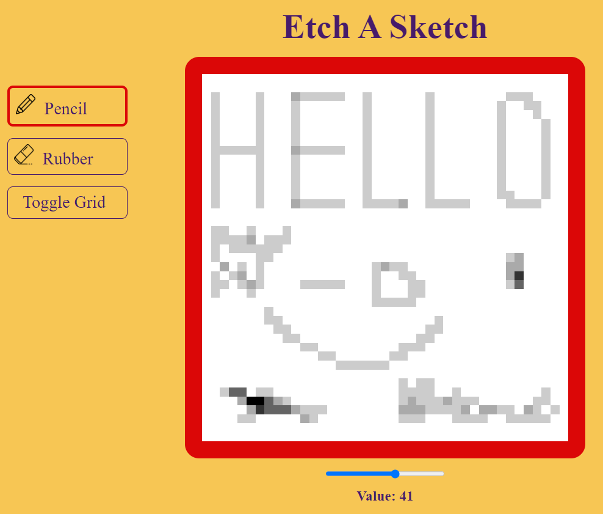

# Etch A Sketch
This is a simple implementation of the classic toy "Etch A Sketch" using HTML, CSS, and JavaScript. The project allows the user to draw on the screen by moving the mouse over it, just like drawing on an Etch A Sketch.

## Demo

[Live](https://lewocz-etch-a-sketch.netlify.app/)

Attribution:
<a href="https://www.flaticon.com/free-icons/pencil" title="pencil icons">Pencil icons created by Those Icons - Flaticon</a>
<a href="https://www.flaticon.com/free-icons/rubber" title="rubber icons">Rubber icons created by Freepik - Flaticon</a>
